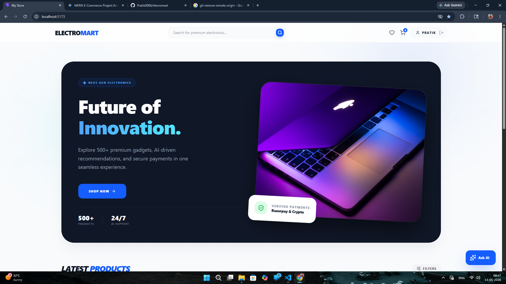
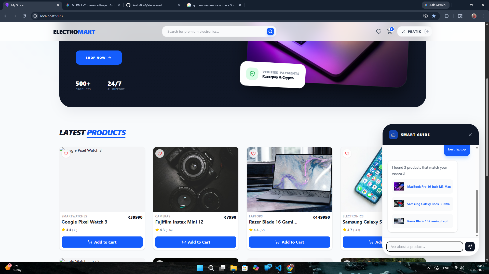
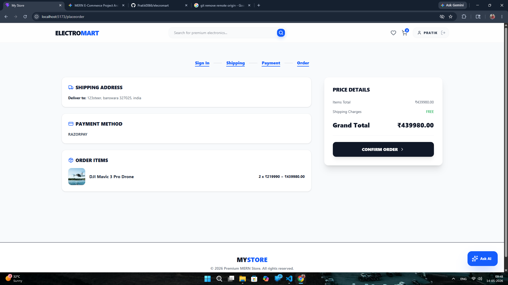

# ElectroMart - AI-Powered MERN E-Commerce

A full-stack electronics e-commerce platform built with the MERN stack (MongoDB, Express, React, Node.js). Features conversational AI for product discovery, AI-driven recommendations, admin dashboard, wishlist, and secure Razorpay payments.

## Features

- **AI Shopping Assistant**: Chatbot that uses OpenAI to interpret natural language and recommend products from the catalog
- **AI Recommendations**: Product pages show AI-suggested related items using OpenAI (with category-based fallback)
- **Admin Dashboard**: Full admin panel with sales analytics, order management, product CRUD, and user management
- **Wishlist**: Save products for later with persist-to-database support
- **Secure Payments**: Razorpay integration with HMAC SHA256 server-side verification
- **State Management**: Redux Toolkit with RTK Query for efficient caching and seamless UX
- **Authentication**: JWT-based auth with HTTP-only cookies, protected routes, and admin middleware
- **Responsive UI**: Tailwind CSS v4 with glassmorphism cards, dark-mode support, and Lucide icons

## Screenshots

### Hero Section


### AI Shopping Assistant


### Product Grid


## Tech Stack

- **Frontend**: React 19 (Vite), Redux Toolkit + RTK Query, React Router 7, Tailwind CSS v4, Lucide React, React Toastify
- **Backend**: Node.js, Express 5, Mongoose 9, JWT, Multer
- **Database**: MongoDB (Atlas)
- **AI**: OpenAI API (with fallback to category-based matching)
- **Payments**: Razorpay SDK
- **Dev Tools**: Nodemon, ESLint, PostCSS, Autoprefixer

## Getting Started

### Prerequisites

- Node.js (v18+)
- MongoDB Atlas account (or local MongoDB)
- Razorpay account (for API keys)
- OpenAI API key (optional — falls back to keyword search)

### Environment Variables

Create a `.env` file in `backend/`:

```env
PORT=5000
MONGO_URI=your_mongodb_atlas_uri
JWT_SECRET=your_jwt_secret
RAZORPAY_KEY_ID=your_razorpay_key_id
RAZORPAY_KEY_SECRET=your_razorpay_key_secret
OPENAI_API_KEY=your_openai_api_key
```

### Installation

```bash
# Install backend dependencies
cd backend && npm install

# Install frontend dependencies
cd ../frontend && npm install
```

### Seed Database

```bash
cd backend
npm run data:import
```

### Run the Project

```bash
# Terminal 1 — Backend
cd backend && npm run dev

# Terminal 2 — Frontend
cd frontend && npm run dev
```

The frontend runs on `http://localhost:5173` and the backend API on `http://localhost:5000`.

---

## Project Structure

```
├── backend/
│   ├── config/           # Database connection
│   ├── controllers/      # Order, Product, User business logic
│   ├── data/             # Sample product & user seed data
│   ├── middleware/        # Auth & admin middleware
│   ├── models/           # Mongoose schemas (Product, User, Order)
│   ├── routes/           # API route definitions
│   ├── utils/            # JWT token generation
│   ├── uploads/          # Product image uploads
│   ├── seeder.js         # Database seed script
│   └── server.js         # Express entry point
├── frontend/
│   ├── public/
│   ├── assets/           # Project screenshots
│   └── src/
│       ├── components/   # AIChatBot, Header, SearchBox, ProductCard, etc.
│       ├── pages/        # Home, Product, Cart, Payment, Wishlist, etc.
│       │   └── admin/    # AdminDashboard, ProductList, OrderList, UserList
│       ├── slices/       # Redux state (auth, cart, API slices)
│       ├── App.jsx
│       ├── store.js
│       └── main.jsx
└── readme.md
```

## API Endpoints

| Endpoint              | Description              | Auth     |
| --------------------- | ------------------------ | -------- |
| `GET /api/products`   | List products (paginated)| Public   |
| `GET /api/products/:id` | Get single product     | Public   |
| `POST /api/products/chat` | AI chat search       | Public   |
| `GET /api/products/:id/recommendations` | AI recommendations | Public |
| `POST /api/users/login` | Login                  | Public   |
| `POST /api/users`     | Register                 | Public   |
| `GET /api/users/profile` | Get profile           | Private  |
| `PUT /api/users/profile` | Update profile        | Private  |
| `POST /api/orders`    | Create order             | Private  |
| `GET /api/orders/:id` | Get order                | Private  |
| `PUT /api/orders/:id/pay` | Verify payment       | Private  |
| `GET /api/admin/*`    | Admin CRUD operations    | Admin    |

## AI Logic

The **AI Shopping Assistant** (`POST /api/products/chat`) and **Recommendations** (`GET /api/products/:id/recommendations`) use OpenAI's API when available. If OpenAI is unavailable or returns no results, they fall back to category-based matching and multi-field database search (name, brand, category).

## Payment Verification

Payments are secured using HMAC SHA256 signatures. The backend verifies every Razorpay transaction (`razorpay_payment_id`, `razorpay_order_id`, `razorpay_signature`) before marking an order as `isPaid`, ensuring a tamper-proof checkout experience.
